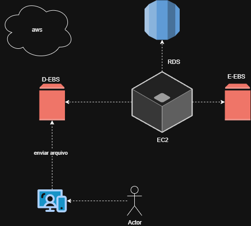
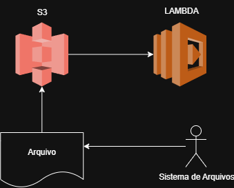

# dio-desafio-ec2-aws

Documentação prática sobre gerenciamento de instâncias EC2 na AWS, como parte do desafio da DIO.

---

# 🚀 Desafio DIO - Instância EC2 na AWS

Este repositório documenta minha experiência prática no uso de instâncias EC2 na AWS, como parte do desafio proposto pela DIO.

## ✅ Etapas Realizadas

- Criação da instância EC2
- Acesso via SSH
- Instalação de pacotes (exemplo: NGINX)
- Criação e gerenciamento de volumes EBS
- Encerramento da instância para evitar custos

## 🧠 Aprendizados

- Como configurar e acessar uma instância EC2
- Importância dos grupos de segurança para controle de acesso
- Gerenciamento e montagem de volumes EBS para armazenamento adicional
- Noções básicas de integração com serviços AWS como RDS e Lambda

## 📊 Diagramas da Arquitetura AWS

Abaixo estão os fluxos representando o uso de serviços AWS, incluindo EC2, S3, Lambda, EBS e RDS, utilizados no desafio.

---

### 🖼️ Fluxo 1 - EC2 com Volumes EBS e Integração com RDS

Neste cenário, o ator interage com uma aplicação hospedada em uma instância EC2. A EC2 está conectada a dois volumes EBS (D e E), responsáveis pelo armazenamento de dados. Além disso, há integração com um banco de dados RDS para persistência e consulta de dados.

---

### 🖼️ Fluxo 2 - Upload para S3 e Processamento com Lambda

Neste fluxo, o usuário envia um arquivo de um sistema local para o Amazon S3. A chegada desse arquivo aciona automaticamente uma função Lambda, que pode processar, validar ou mover o arquivo para outro serviço.

---

## 📚 Referências

- [Documentação oficial da EC2 (AWS)](https://docs.aws.amazon.com/pt_br/ec2/)

